This code performs the [2-d Discrete Cosine Transform](https://en.wikipedia.org/wiki/Discrete_cosine_transform#Multidimensional_DCTs) on images. It can save to disk the spectrum of a image in png or binary format, and it can perform the inverse DCT to reconstruct the image from the spectrum (or a modified version of it). It can also generate the basis images for a certain width and height, by performig the inverse DCT on spectums with only one non-zero element.

Here are some images generated from various spectra:

Decription | Spectrum | Image
:-:|:-:|:-:
original image | 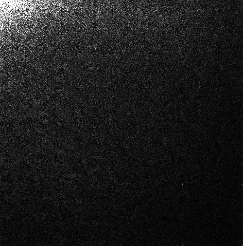  |  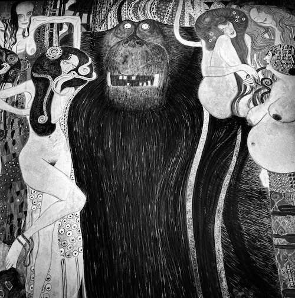
only high frequencies | 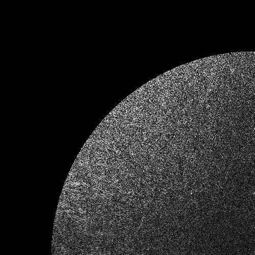 | 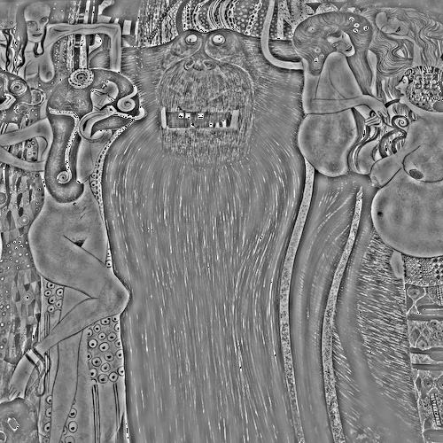
original image |   |  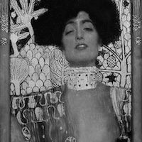
ony low frequencies | 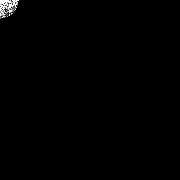 | 
no low frequencies | 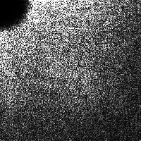 | 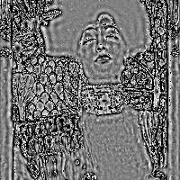
no low e medium frequencies | 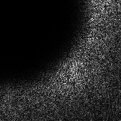 | 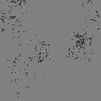
no horizontal low frequencies | 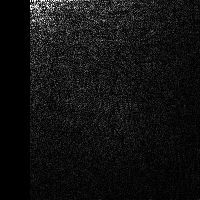 | 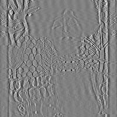
no vertical low frequencies | 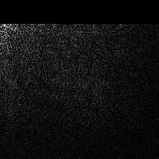 | 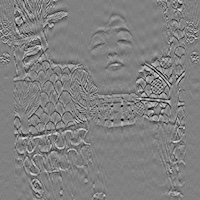
only high frequencies | 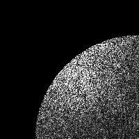 | 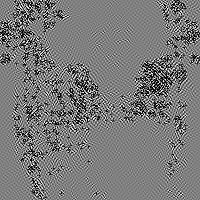
only low horizontal and high vertical frequencies | 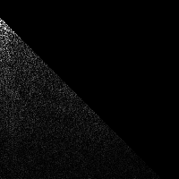 | 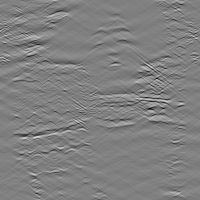
only high horizontal and low vertical frequencies | 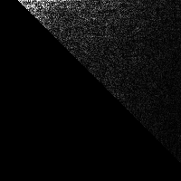 | 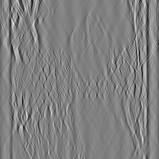