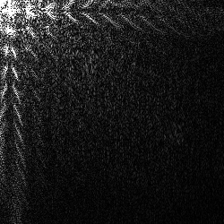
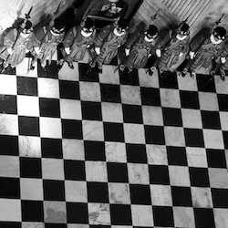
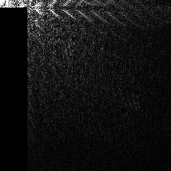
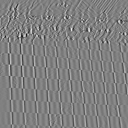
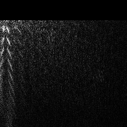
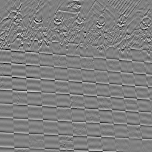
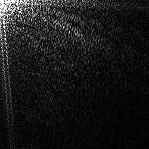
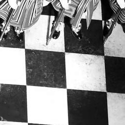

This code performs the [2D Discrete Cosine Transform](https://en.wikipedia.org/wiki/Discrete_cosine_transform#Multidimensional_DCTs) on images. It can save to disk the spectrum of a image in png or binary format, and it can perform the inverse DCT to reconstruct the image from the spectrum (or a modified version of it). It can also generate the basis images for a certain width and height, by performig the inverse DCT on spectums with only one non-zero element.

Here are some images generated from various spectra:

Decription | Spectrum | Image
:-:|:-:|:-:
original image |   |  
no low frequencies |  | 
original image |  | 
no high vertical frequencies |  | 
no high horizontal frequencies |  | 
original image |  | 
original image |   |  
ony low frequencies |  | 
no low frequencies |  | 
only high frequencies |  | 
only very high frequencies |  | 
removed low frequences and high vertical frequences |  | 
removed low frequences and high horizontal frequences |  | 
??? |  | 
??? |  | 

the gorilla took 15 minutes to spectralize.
