`main.c` performs the [2D Discrete Cosine Transform](https://en.wikipedia.org/wiki/Discrete_cosine_transform#Multidimensional_DCTs) on images.

$$
X_{k_1,k_2} = \sum_{n_1=0}^{N_1 - 1} \sum_{n_2=0}^{N_2 - 1} x_{n_1,n_2} 
\cos\left[ \frac{\pi}{N_1} \left(n_1 + \frac{1}{2} \right) k_1 \right] 
\cos\left[ \frac{\pi}{N_2} \left(n_2 + \frac{1}{2} \right) k_2 \right].
$$

It can save to disk the spectrum of a image in png or binary format, and it can perform the inverse DCT to reconstruct the image from the spectrum (or a modified version of it). It can also generate the basis images for a certain width and height, by performig the inverse DCT on spectums with only one non-zero element.

Here are some images generated from various spectra:

Decription | Spectrum | Image
:-:|:-:|:-:
original image | 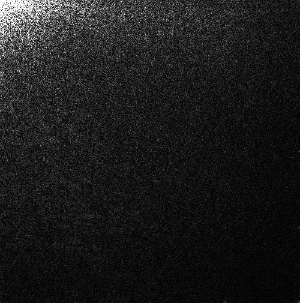  |  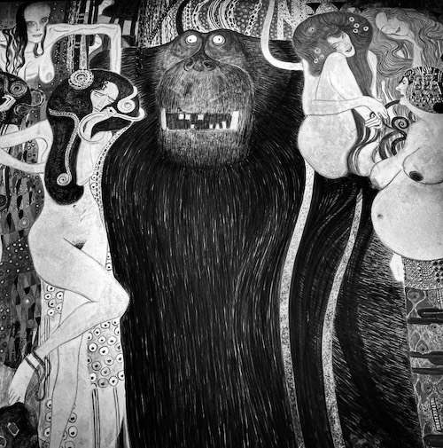
no low frequencies | 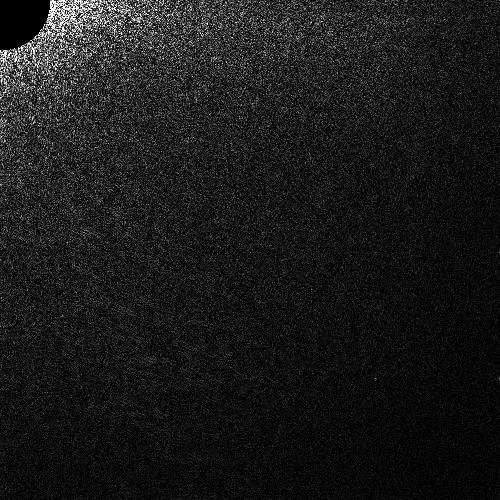 | 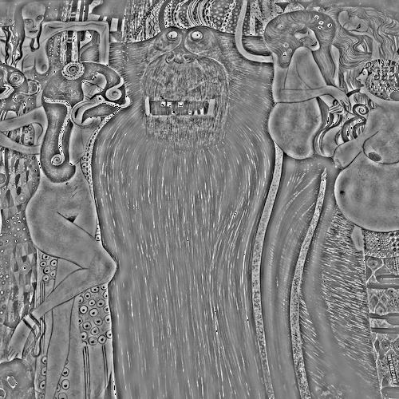
original image | 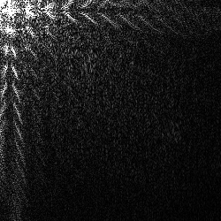 | 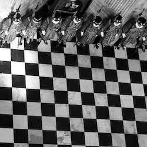
no high vertical frequencies | 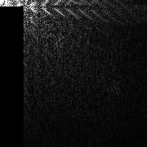 | 
no high horizontal frequencies | 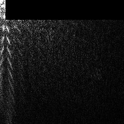 | 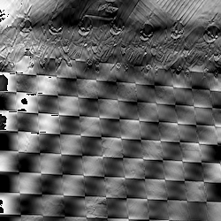
original image | 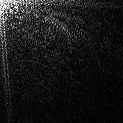 | 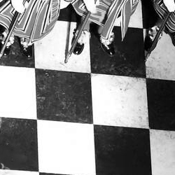
original image | 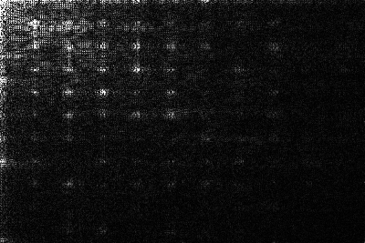 | 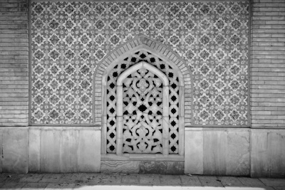
original image | 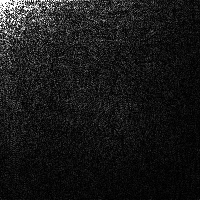  |  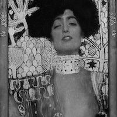
ony low frequencies | 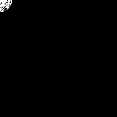 | 
no low frequencies | 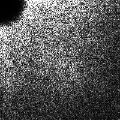 | 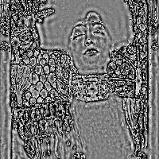
only high frequencies | 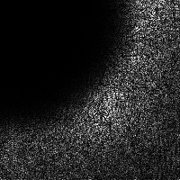 | 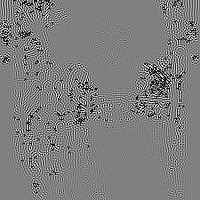
only very high frequencies | 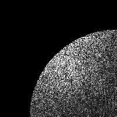 | 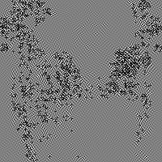
removed low frequences and high vertical frequences | 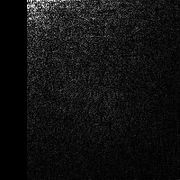 | 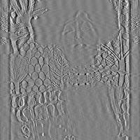
removed low frequences and high horizontal frequences | 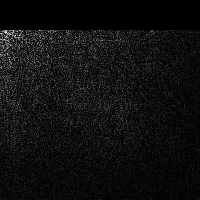 | 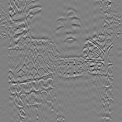
??? |  | 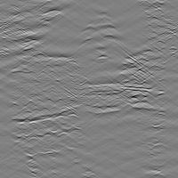
??? | 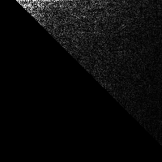 | 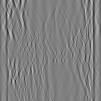

Alternatively one can also use the Matlab script `prova.m`
